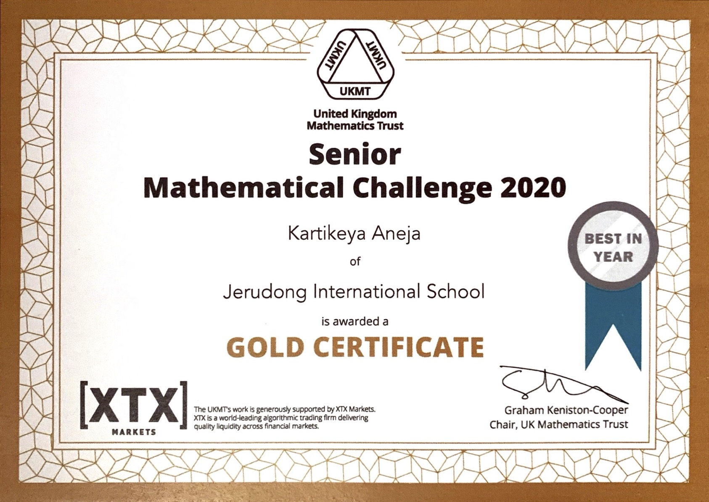
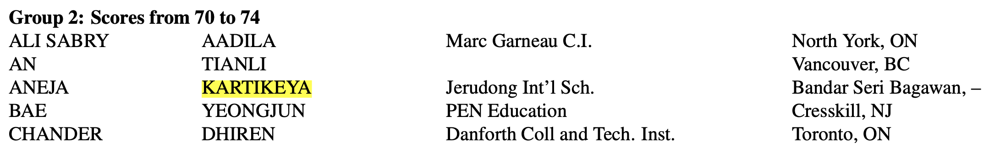
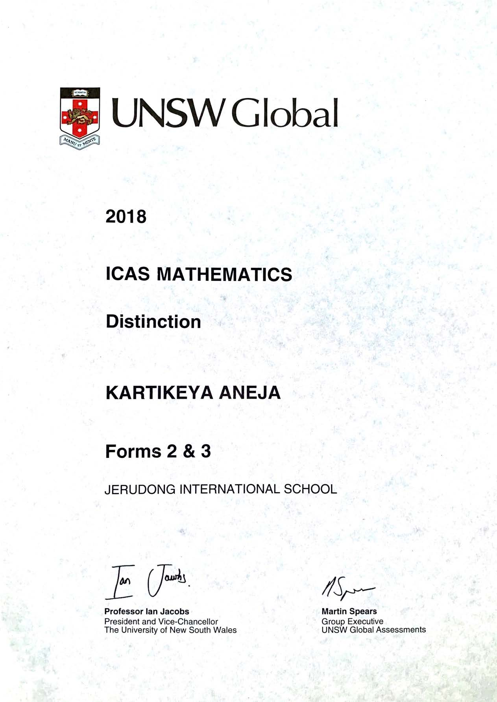

# UKMT Senior Mathematics Challenge

| Earned Gold Certificate in [UKMT Senior Mathematical Challenge](https://www.ukmt.org.uk/competitions), 2020 |
| :----------------------------------------------------------: |
|                           |
|                                    |
| *[Borneo Bulletin](https://borneobulletin.com.bn/excelling-at-international-computer-challenge/)* |

## [Canadian Computing Competition 2021 (https://cemc.uwaterloo.ca/contests/past_contests/2021/2021CCCResults.pdf)

## Earned Group 2 in the world

|                                     |
| :----------------------------------------------------------: |
| *[Borneo Bulletin](https://borneobulletin.com.bn/excelling-at-international-computer-challenge/)* |

 

| [Teens In AI Hackathon Brunei, 2020](https://www.teensinai.com/brunei/) |
| ------------------------------------------------------------ |

What it is:

* Solve a United Nations Sustainable Development goal using Technology in groups of 5-6

Our Solution to SG 4: Quality Education:

* RoamLearn:
  * Online Classroom Platform
  * Video Chatting with added support for teachers
    * Break students into groups in seperate calls
    * Speech-To-Text to log classes and conversations

 

## ICAS Digital Technologies

* 2019: Distinction
* 2017: Merit
* 2015: Distinction
* 2014: Credit

| Distinction in [ICAS Digital Technologies 2019](https://www.icasassessments.com/products-icas/) |
| :----------------------------------------------------------: |
|                               |

 

## ICAS Mathematics

* 2019: Credit
* 2018: Distinction
* 2016: Distinction
* 2015: Distinction
* 2014: Distinction
* 2013: Distinction

  

| Distinction in [ICAS Mathematics 2018](https://www.icasassessments.com/products-icas/) |
| :----------------------------------------------------------: |
|                            |

 

## ICAS Science

* 2019: Credit
* 2017: Distinction
* 2015: Distinction
* 2014: Credit

|     Credit in ICAS Science 2019      |
| :----------------------------------: |
|  |

## Participated in South East Asian Mathematics Competition (SEAMC) 2016, Manila

<blockquote class="twitter-tweet">
A big breakfast with some big maths problems! That’s how the <a href="https://twitter.com/hashtag/JISBrunei?src=hash&amp;ref_src=twsrc%5Etfw">#JISBrunei</a> <a href="https://twitter.com/hashtag/maths?src=hash&amp;ref_src=twsrc%5Etfw">#maths</a> team started their first day at <a href="https://twitter.com/hashtag/SEAMC18?src=hash&amp;ref_src=twsrc%5Etfw">#SEAMC18</a> <a href="https://twitter.com/hashtag/girlslovemathstoo?src=hash&amp;ref_src=twsrc%5Etfw">#girlslovemathstoo</a> <a href="https://t.co/pMzw2PZyXI">pic.twitter.com/pMzw2PZyXI</a>
&mdash; Jerudong International School (@JISBrunei) <a href="https://twitter.com/JISBrunei/status/969446492866953216?ref_src=twsrc%5Etfw">March 2, 2018</a></blockquote> 

