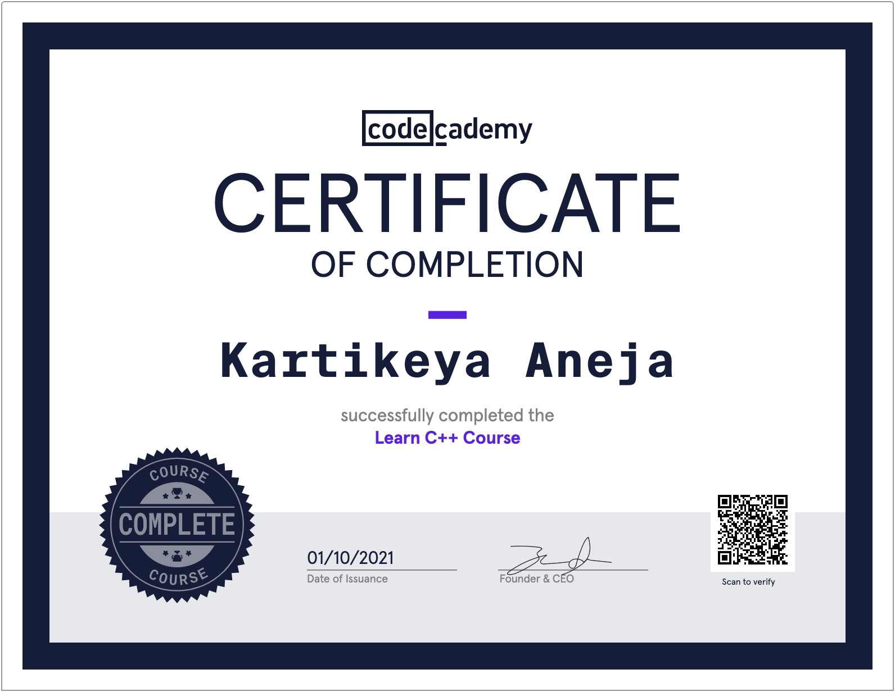

## [Canadian Computing Competition 2021 - Ranked Group 2 (Scores from 70 to 74)](https://cemc.uwaterloo.ca/contests/past_contests/2021/2021CCCResults.pdf)

|                                     |
| :----------------------------------------------------------: |
| *[Borneo Bulletin](https://borneobulletin.com.bn/excelling-at-international-computer-challenge/)* |

|                                    |
| :----------------------------------------------------------: |
| *[Borneo Bulletin](https://borneobulletin.com.bn/shining-at-uk-maths-challenge/)* |

# UKMT Mathematics

| Awarded Gold Certificate at [UKMT Senior Mathematical Challenge](https://www.ukmt.org.uk/competitions) 2020 |
| :----------------------------------------------------------: |
|                                   |
| *JIS Principal Nicholas Sheehan and Head of the Maths Faculty Phil May with gold winners. PHOTO: JIS* |
|                           |
|                                                              |

<blockquote class="twitter-tweet">
Congratulations to <a href="https://twitter.com/hashtag/JISSeniors?src=hash&amp;ref_src=twsrc%5Etfw">#JISSeniors</a> winning Gold, Silver and Bronze Awards at the annual Senior Maths Challenge (SMC). <a href="https://twitter.com/hashtag/Maths?src=hash&amp;ref_src=twsrc%5Etfw">#Maths</a> <a href="https://twitter.com/hashtag/MathsChallenge?src=hash&amp;ref_src=twsrc%5Etfw">#MathsChallenge</a> <a href="https://twitter.com/hashtag/MathsOlympiad?src=hash&amp;ref_src=twsrc%5Etfw">#MathsOlympiad</a> <a href="https://twitter.com/hashtag/SeniorMathsChallenge?src=hash&amp;ref_src=twsrc%5Etfw">#SeniorMathsChallenge</a> <a href="https://twitter.com/hashtag/JISBrunei?src=hash&amp;ref_src=twsrc%5Etfw">#JISBrunei</a> <a href="https://t.co/N8OzuxBHty">pic.twitter.com/N8OzuxBHty</a>
&mdash; Jerudong International School (@JISBrunei) <a href="https://twitter.com/JISBrunei/status/1332293156046577664?ref_src=twsrc%5Etfw">November 27, 2020</a></blockquote> 

 

# [Code Academy Courses](https://www.codecademy.com/)

* [C++](https://www.codecademy.com/profiles/KartikeyaAneja/certificates/b74a2390dfc4127fa5d43fe147425ad0)
* [Statistics with Numpy](https://www.codecademy.com/profiles/coursePro51225/certificates/43135f7494712f4c3b1ced1a55be7be1)
* [Data Visualization with Python](https://www.codecademy.com/profiles/coursePro51225/certificates/860af2d9669986c16383635c3a16d4aa)
* [SQL](https://www.codecademy.com/profiles/coursePro51225/certificates/042a4e5884e3eb6ea1f2a12be6abb851)
* [Command Line](https://www.codecademy.com/profiles/coursePro51225/certificates/c87ba0541f8be78bc2f4ba1128233f6f)

 

|                  C++                  |
| :-----------------------------------: |
|           |
|       **Statistics with Numpy**       |
|    |
|  **Data Visualization with Python**   |
|      |
|                **SQL**                |
|           |
|           **Command Line**            |
|  |

 

## ICAS Digital Technologies

* 2019: Distinction
* 2017: Merit
* 2015: Distinction
* 2014: Credit

| Distinction in [ICAS Digital Technologies 2019](https://www.icasassessments.com/products-icas/) |
| :----------------------------------------------------------: |
|                               |

 

## ICAS Mathematics

* 2019: Credit
* 2018: Distinction
* 2016: Distinction
* 2015: Distinction
* 2014: Distinction
* 2013: Distinction

  

| Distinction in [ICAS Mathematics 2018](https://www.icasassessments.com/products-icas/) |
| :----------------------------------------------------------: |
|                            |

 

## ICAS Science

* 2019: Credit
* 2017: Distinction
* 2015: Distinction
* 2014: Credit

|     Credit in ICAS Science 2019      |
| :----------------------------------: |
|  |

