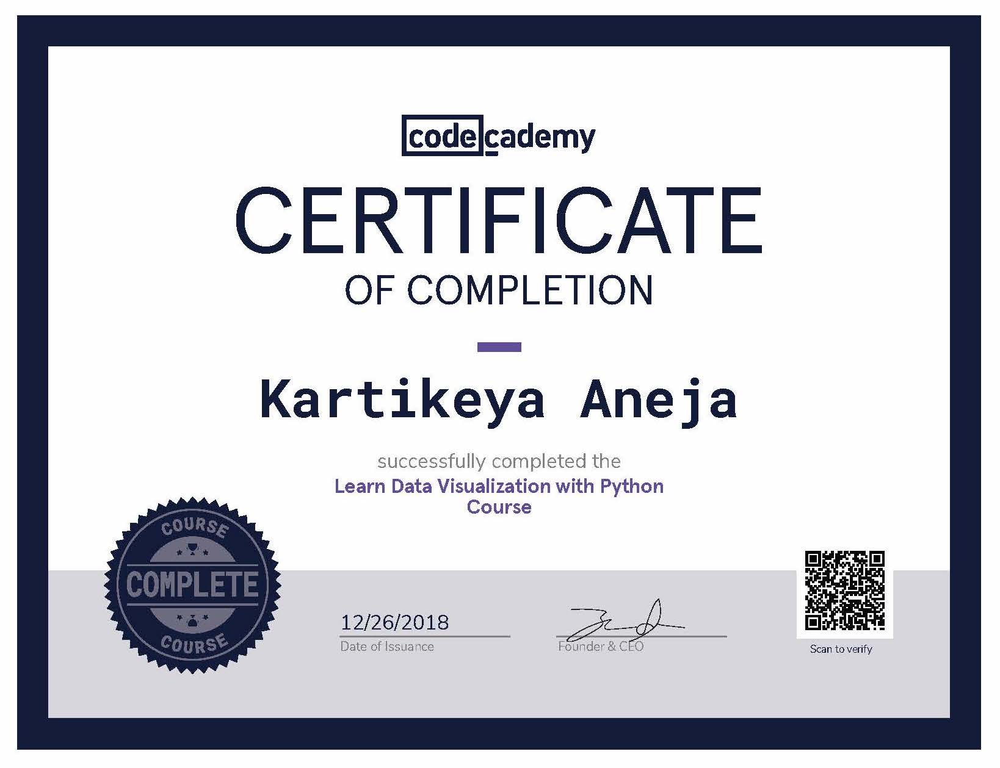

| [The Duke of Edinburgh's Bronze Award](https://dofehillary.org.nz/bronze)     Six Months of Voluntary Service, Learning new Skills, Physical Recreation and an Adventurous Journey |
| :----------------------------------------------------------: |
|                                          |

# [Code Academy Courses](https://www.codecademy.com/)

* ## [Statistics with Numpy](https://www.codecademy.com/profiles/coursePro51225/certificates/43135f7494712f4c3b1ced1a55be7be1)

* ## [Data Visualization with Python](https://www.codecademy.com/profiles/coursePro51225/certificates/860af2d9669986c16383635c3a16d4aa)

* ## [C++](https://www.codecademy.com/profiles/KartikeyaAneja/certificates/b74a2390dfc4127fa5d43fe147425ad0)

